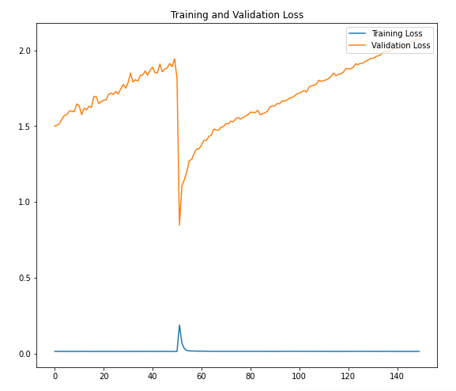
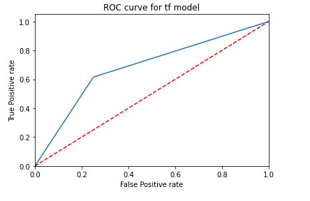

# MTXhackathon-2021

## Problem statement
There is a colossal amount of video data for sports. The first step to employ this data for performance enhancement and improved decision making, both on a team as well as an athlete level, might be to develop algorithms that make machines understand the important events that take place during a sports match. To that end, the goal of this problem statement is to detect the occurrence of scoring events in basketball game videos. We are interested in detecting only two modes of scoring, i.e 2 pointers and 3 pointers. Given a video snippet, the objective is to perform binary classification to predict if the input video snippet contains a scoring event (either 2 pointer or 3 pointer) or not.

## Technology stack 
* HTML, CSS & Javascript
* FLask API 
* Keras tensorflow 
* Docker 

## Model development 

The data is pre-processed where the video files are segmented into frames and converted into grayscale. The training dataset is divided into train and validation set in 8:2 ratio and is taken for model training. Sequential model is developed with 3 layers of Conv2D followed by Dense layer, except the layer all other layers used ReLU activationa and the output layer uses sigmoid activation. To measure loss, a sparse categorical cross entropy is used and the model is trained for 250 epochs and the evaluation metrics are dicussed below.

### Training Loss graph

## Evaluation 

| Metric | value (in %) |
|------------|-----------|
| `Accuracy`  | `69.0`  | 
| `Precision`  | `66.0` |
| `Recall` | `66.0`  |
| `AUC` | `68.2` |
| `F1-score` | `69.0` |

### Accuracy graph

### ROC Curve 

## Usage

To work locally, download the code base and install all the requirements with following command.
NOTE : Supported python runtime is 3.7 
> pip install -r requirements.txt 

Run the wsgi script file to start localhost runtime
> python wsgi.py 

To perform input operations, follow the server link to access the website. The results are shown in plot, indicating scoring and non-scoring probabilities.

Also, use the docker image for project setup. With the below command, pull the image and run in a container 

> docker pull ratva071701/mtx-hackathon:latest

> docker run -it image_name /bin/bash

> source my-env/Scripts/activate

> python3 wsgi.py

Now, follow the link and access the website.
